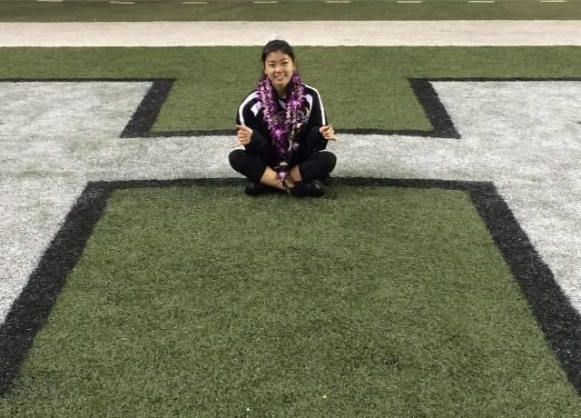

## Aloha! 🌺

My name is Robynne Asato. I am a momther who was born and raised on the island of Oahu in Hawai'i.
 

I am currently attending Arizona State University through the Starbucks College Achievement Program to earn a Bachelors of Science in Food and Nutrition Entrepreneurship. I find web development to be a unique and fun creative outlet, so I am also looking into adding a Bachelors of Applied Science in Internet and Web Development. After graduating, I am hoping to continue my education with ASU to earn a Masters of Science in Graphic Information Technology.

I hope to use my two Associate of Science degrees in Culinary arts and Baking, as well of my Bachelors and Masters degree to achieve my career goal of opening my own restaurant on Oahu, inspired by the unique mix of local cuisine.

Outside of school and work, My most important role is being a mother to my daughter and son. I am also a Color Guard Instructor with the University of Hawai'i Marching Band, as well as various high school marching band programs on the island.
 
<!--
**raasato/raasato** is a ✨ _special_ ✨ repository because its `README.md` (this file) appears on your GitHub profile.

Here are some ideas to get you started:

- 🔭 I’m currently working on ...
- 🌱 I’m currently learning ...
- 👯 I’m looking to collaborate on ...
- 🤔 I’m looking for help with ...
- 💬 Ask me about ...
- 📫 How to reach me: ...
- 😄 Pronouns: ...
- ⚡ Fun fact: ...
-->
